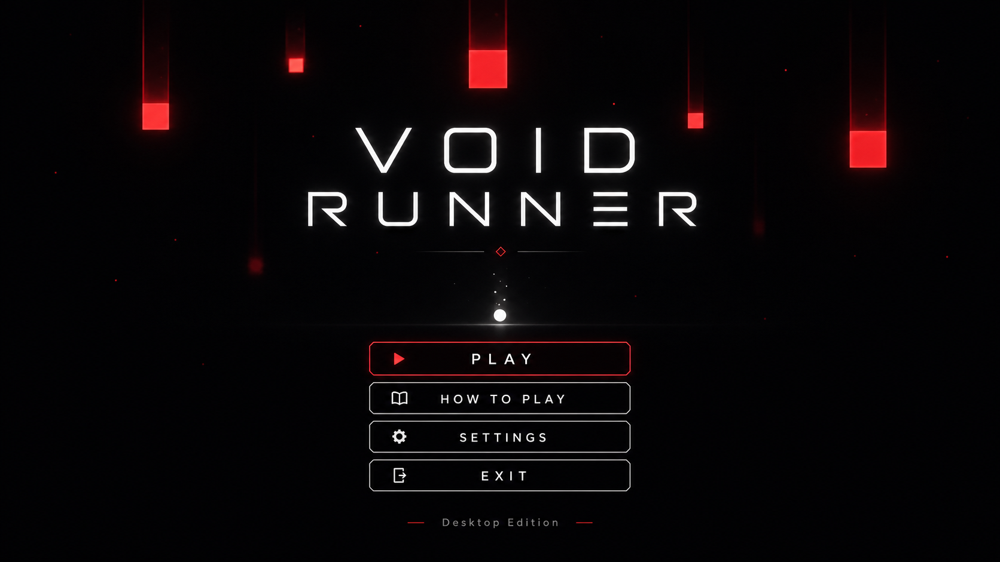

# VOID RUNNER

**VOID RUNNER** is a minimalist 2D arcade survival game built with Python and Pygame.

Control a glowing white runner, dodge falling red obstacles, collect blue gems, and survive as long as possible. The game uses a dark neon visual style with smooth trails, glowing particles, animated obstacles, gem collection, difficulty modes, score tracking, and a complete desktop game flow.

---

## Preview

### Home Screen



### Gameplay


### How To Play


### Game Over


---

## About the Game

VOID RUNNER is designed to be simple, fast, and visually polished.

The main goal is:

> Avoid the red blocks. Collect blue gems. Beat your best score.

The game is intentionally minimalist, using simple shapes and clean UI instead of complex assets. Even though the mechanics are simple, the glowing effects, trails, score system, and screen flow make it feel like a complete desktop game.

---

## Features

- Minimalist dark neon UI
- Home screen
- Main gameplay screen
- How To Play screen
- Settings screen
- Pause screen
- Game Over screen
- Smooth player movement
- White glowing player trail
- Falling red obstacles with motion trails
- Falling blue gems with sparkle effect
- Gem collection score system
- Easy / Medium / Hard difficulty modes
- Best score saving
- Retry, Home, and Exit controls
- Windows `.exe` build support

---

## Gameplay

The player controls a small glowing white ball.

Red blocks fall from the top of the screen. If the player touches a red block, the game ends.

Blue gems also fall from the top. Collecting gems increases the score.

The longer the player survives, the harder the game becomes.

---

## Difficulty Modes

| Mode | Description |
|---|---|
| Easy | Fewer obstacles, slower speed, safer gameplay |
| Medium | Balanced default gameplay |
| Hard | More obstacles, faster movement, higher gem value |

---

## Controls

| Key | Action |
|---|---|
| `W` / `Arrow Up` | Move up |
| `S` / `Arrow Down` | Move down |
| `A` / `Arrow Left` | Move left |
| `D` / `Arrow Right` | Move right |
| `ESC` | Pause / Back |
| `P` | Pause |
| Mouse Click | Select menu buttons |

---

## Tech Stack

- Python
- Pygame
- PyInstaller

---

## Project Structure

```text
VOID-RUNNER/
│
├── main.py
├── README.md
├── requirements.txt
├── .gitignore
│
├── Pics/
│   ├── Home.png
│   ├── Game play.png
│   ├── how to play.png
│   └── game over.png
│
├── src/
│   ├── __init__.py
│   ├── game.py
│   ├── gem.py
│   ├── obstacle.py
│   ├── player.py
│   ├── screens.py
│   ├── settings.py
│   ├── storage.py
│   └── ui.py
│
└── data/
    └── highscore.txt
